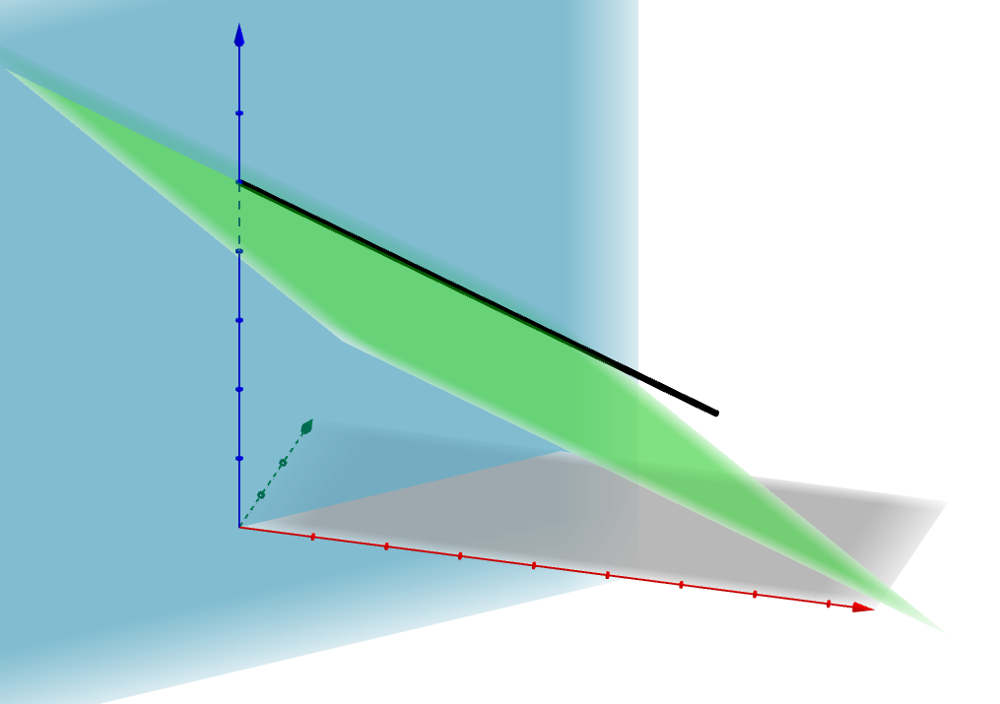

## 标准型的多面体

​		一个标准型的多面体可以表示为$P=\{x\in R^n\vert Ax=b,x\ge0\}$，其中**A**是一个$m\times n$的矩阵，对应m个等式约束和n个变量，并假设m个约束是相互独立(这要求$m\le n$，事实上线性相关的约束可以被舍弃而不影响解的性质)

​		上一章提到，一个基解是通过求解n个线性无关约束组成的线性方程组得到的，由于标准型的约束数量m不多于n，为了获得一个基解，需要选择m-n个变量并令它们为0，即令这m-n个变量对应的约束$x_i\ge0$成为有效约束。其中对于这m-n个约束的选择并不是随意的。

**定理**：对于一个标准型的多面体，向量$x\in R^n$是一个基解当且仅当有$Ax=b$，且存在索引$B(1),\dots,B(m)$令：

1. 列$A_{B(1)},\dots, A_{B(m)}$相互线性独立
2. 如果$i\neq B(1),\dots,B(m)$，则$x_i=0$

**证明**：假设$x\in R^n$，且存在$B(1),\dots,B(m)$满足定理的表述，则有
$$
\sum_{i=1}^{m}A_{B(i)}x_{B(i)}=\sum_{i=1}^nA_ix_i=Ax=b
$$
​		由于列$A_{B(1)},\dots, A_{B(m)}$相互线性独立，因此$x_{B(1)},\dots,x_{B(m)}$的值是唯一的，即由n个有效约束形成的线性方程组有唯一解(其余n-m个变量值都为0)，说明$x$是一个基解。

​		相反，若$x$是一个基解。令$x_{B(1)},\dots,x_{B(k)}$表示$x$中非0的索引。由于$x$是基解，因此线性方程组$\sum_{i=1}^nA_ix_i=b$和$x_i=0,i\neq B(1),\dots,B(k)$有唯一解，即$x_{B(1)},\dots,x_{B(k)}$是线性方程组组$\sum_{i=1}^kA_ix_i=b_i$的唯一解，进而得到$A_{B(1)},\dots A_{B(k)}$是线性独立的。因为若不是相互线性独立，则存在不全为零的标量$\lambda_1,\dots,\lambda_k$满足$\sum_{i=1}^kA_i\lambda_i=0$，进而$\sum_{i=1}^kA_i(x_i+\lambda_i)=b_i$，与前面解的唯一性相矛盾。

<!--more-->

​		由于$A_{B(1)},\dots A_{B(k)}$线性独立，则可以得出$k\le m$(矩阵最大的秩为m)。由于m有个线性独立的行，也一定能找到m个线性独立的列。因此，我们能找到m-k个额外的列$A_{k+1},\dots,A(m)$使得列$A_{B(1)},\dots,A_{B(m)}$线性独立。则如果$i\neq B(1),\dots,B(m)$，有$i\neq B(1),\dots,B(k)$，得到$x_i=0$。因此，定理的两个表述都得到满足。

​		根据以上理论，任何一个基解都可以用以下的步骤确定：

1. 选择m个线性独立的列$A_{B(1)},\dots A_{B(m)}$
2. 对所有$i\neq B(1),\dots,B(m)$,令$x_i=0$
3. 解线性方程组$Ax=b$，$[x_{B(1)},\dots,x_{B(m)}]^T$

​		通过以上步骤，如果得到的基解都是非负的，则该基解是一个基可行解。对于一个基解，变量$x_{B(1)},\dots,x_{B(m)}$被称为基变量(basic variables)，其余变量被称为非基变量(nonbasic)，而基向量对应的列$A_{B(1)},\dots A_{B(m)}$被称为基列向量(basic columns)，这m个向量构成了空间$R^m$的一个基。一般认为如果两个基有不同的索引$\{B(1),\dots,B(m\}$，则称这两个基是不同的(索引相同顺序不同也视为同一个基)

​		在确定一个基后，该基的值可以通过求解线性方程组$Bx_B=b$来确定，其中$B$是由所有基变量对应的列向量组成的$A$的一个分块矩阵，由于$B$的列向量都是线性独立的，因此$B$一定可逆，$x_B$可以通过计算$B^{-1}b$唯一确定。

​		从另一个角度看，$Ax=b$或$\sum_{i=1}^nA_ix_i=b$可以看做为列向量$A_i$通过对应的系数$x_i$相加而合成向量$b$。假设考虑一个m=2, n=4的标准型，4个变量列向量分别对应下图中的$A_1,A_2,A_3,A_4$，当令$A_1,A_2$形成一个基时，得到的基解是不可行的，因为$x_2$一定要小于0才能将$A_1,A_2$合成到$b$。同理$A_1,A_3$为基得到的基解是可行的，而$A_1,A_4$无法形成一个基，因为这两个向量是线性相关的。

### 基和基解的对应关系

前文提到两个基解是相邻的当它们有相同的n-1个有效约束，在标准形式下，我们称两个基是相邻的当它们有n-1个相同的基列向量索引，因此相邻的基解可以通过相邻的基获得。

**推论**：令$P=\{x\vert Ax=b,x\ge0\}$为一个非空的多面体，其中$A$是一个$m\times n$矩阵，其行索引为$a_1',\dots,a_m'$，假设$rank(A)=k\lt m$且行$a_{i1}',\dots,a_{ik}'$是线性独立的，则多面体$Q=\{x\vert a'_{i1}x=b_{i1},\dots,a_{ik}'x=b_{ik},x\ge0\}$，则$Q=P$

**证明**：假设矩阵A的前k行是线性独立的，即$i_1=1,\dots,i_k=k$。显然$P\subset Q$,因为任何满足Q所有约束的解都满足P的所有约束。由于$rank(A)=k$，则行向量$a_{i1}',\dots,a_{ik}'$构成了行空间的一个基，因此A的任意一个行向量$a_i'$都能表示为$a_i'=\sum_{j=1}^k\lambda_{ija_j'}$.令$x$表示P的一个约束，则
$$
b_i=a_i'x=\sum_{j=1}^k\lambda_{ij}a_j'x=\sum_{j=1}^k\lambda_{ij}b_j
$$
因此，对于Q中的任意一个元素y，都可以表示为：
$$
a_i'y=\sum_{j=1}^k\lambda_{ij}a_j'y=\sum_{j=1}^k\lambda_{ij}b_j=b_i
$$
即$y\in P$，因此得到$Q\subset P$，进而推出$Q=P$

因此，在可行域非空的情况下，一个标准型的线性规划问题总能转为一个所有等式约束都相互独立的等价的标准型问题。

### 退化解

**定义**：当在基解$x$处有超过n个有效约束，则称$x\in R^n$是退化解。

在二维空间，一个退化解是三个及以上直线的交点，三维空间是四个以上平面的交界。考虑多面体P：
$$
\begin{align}
x_1+x_2+2x_3&\le8\\
x_2+6x_3&\le12\\
x_1&\le4\\
x_2&\le6\\
x_1,x_2,x_3&\ge0\\
\end{align}
$$
​		向量$x=(2,6,0)$不是退化解，而向量$x=(4,0,2)$是退化解，因为它同时满足4个有效约束，分别为$x_1+x_2+2x_3\le8,x_2+6x_3\le12,x_1\le4,x_2\ge_0$

​		而对于一个标准型的多面体，其m个等式约束一定是有效的，因此拥有超过n个有效约束与拥有超过n-m个值为零的变量是等价的，即引出以下定义：

**定义**：对于标准型$P=\{x\in R^n\vert Ax=b,x\ge0\}$, $x$是一个基解, m是$A$的行数。当向量$x$有超过n-m个为的元素，$x$是一个退化的基解。

当基解$x$是退化的时候，我们有超过一种方式从这些值为的变量中选择n-m个变量作为非基变量，在这种情况下，会出现几个不同的基对应同一个基解的情况。

一个基可行解的退化不完全是多面体的几何性质，它依赖于一个多面体的特定描述。考虑多面体：
$$
P=\{(x_1.x_2,x_3)\vert x_1-x_2=0,x_1+x_2+2x_3=2,x_1,x_2,x_3\ge0\}
$$

该多面体n=3,m=2，则n-m=1.向量(1,1,0)是非退化解，因为只有一个变量值为0.而向量(0,0,1)是退化解，因为有2个变量值为0.但对该多面体换一种方式描述$P=\{(x_1.x_2,x_3)\vert x_1-x_2=0,x_1+x_2+2x_3=2,x_1,x_3\ge0\}$,向量(0,0,1)就不再是一个退化基可行解了。

因此，一个基可行解在一种表述下是退化解，而在另一种表述下可能就不是退化解。

## 极点(extreme point)

### 极点的存在性

本节说明极点存在的条件，首先引入下面的概念：

**定义**：多面体$P\subset R^n$含有一条直线，当存在向量$x\in P$和非零向量$d\in R^n$对于任意标量$\lambda$满足$x+\lambda d\in P$

不是所有多面体都有极点的，如一个半空间就不存在顶点，下面将给出极点存在性的等价表示：

**定理**：设多面体$P=\{x\in R^n\vert a_i'x\ge b_i,i=1,\dots,m\}$非空，则一下表述是等价的：

1. 多面体P至少存在一个极点
2. 多面体P不含有一条直线
3. 在向量组$a_1,\dots,a_m$中有n个相互线性独立的向量

**证明**：

(2)→(1)：首先证明如果P不含有一条直线，则一定存在一个极点。令$x$为P中的一个元素，且$I=\{i\vert a_i'x=b_i\}$。如果I中存在n个线性无关的向量，即有n个线性无关的独立约束，则$x$显然是一个基可行解，根据之前的证明，基可行解和极点是等价的。若I中不存在n个线性无关的向量，则所有$a_i,i\in I$构成了$R^n$的一个子空间，则存在非零向量$d\in R^n$与所有$a_i,i\in I$正交使$a_i'd=0,i\in I$。考虑向量$y=x+\lambda d$，当$i\in I$时，$a_i'y=a_i'x+\lambda a_id=a_i'x=b_i$，即对于I中的约束仍为有效约束。但由于多面体不含有直线，因此当$\lambda$大到某一个值$\lambda^*$时一定会有一些约束$j\notin I$将要被违背，这时候的向量y相比向量x多了一个有效约束，通过这样的方式不断添加有效约束，最终可以得到一个极点。

(1)→(3)：如果P是一个极点，则P也是一个基可行解，因此在$x$处存在n个有效约束，其对于的向量$a_i$也是相互线性独立的

(3)→(2)：不失一般性假设$a_1,\dots,a_n$是相互线性独立的。若$P$存在一条直线$x+\lambda d$，$d\in R^n,d>0$则对所有的$i,\lambda$有$a_i'(x+\lambda d)\ge b_i$，因此$a_i'd=0$，但由于$a_i,\dots,a_n$是相互线性独立的能够构成$R_n$的一个基，则d=0，与前面假设矛盾，因此多面体不存在一条直线。

一个有界的多面体不存在一条直线，比如一个正象限$\{x\vert x\ge 0\}$不存在一条直线。由于一个标准型的多面体被正象限所包括，它一定也不存在一条直线，因此一个非空有界的多面体或一个标准型的多面体至少有一个基可行解。

### 极点的最优性

在建立极点的存在性条件后，本节将证明如果一个线性规划问题有最优解且可行域存在至少一个极点，则最优解出现在极点上。

**定理**：可行域为多面体P的线性规划问题以最小化成本$c'x$为目标函数，设P有至少一个极点且问题有最优解，则存在一个最优解是P的一个极点。

**证明**：令Q表示最优解的集合，v表示成本$c'x$的最小值，则Q可以表示为$Q=\{x\in R^n\vert Ax\ge b,c'x=v\}$，也是一个多面体。由于P存在极点，即P不存在一条直线，而$Q\subset P$，也不存在一条直线，有至少一个极点。设$x^*$为Q的一个极点，若$x^*$不是P的极点，存在$y\in P,z\in P$使得$x=\lambda y+(1-\lambda)z,z\in[0,1]$, 则$v=c'x=c'\lambda y+c'(1-\lambda)z$，由于v是原问题的最优解，$c'y\ge v,c'z\ge z$，只有$c'y=c'z=v$时等式成立，这表示$y\in Q,z\in Q$，与$x^*$是Q的一个极点相矛盾，因此$x^*$是P的一个极点。

上述证明适用于标准型或有界的多面体，因为它们不包含直线。下面的证明将表示如果最优解不是无穷的，则一定存在最优解出现在极点上。

**定理**：可行域为多面体P的线性规划问题以最小化成本$c'x$为目标函数，设P至少有一个极点，则要么最优解的值为$-\infty$，或存在一个极点为最优解。

**证明**：在证明前使用以下术语：向量$x\in P$的秩为k，当在$x$处可以找到最多k个线性无关的有效约束。设最优解是有界的，考虑一些$x\in P,rank(x)=k<n$，令$I=\{i\vert a_i'x=b_i\}$，由于k<n，因此$a_i,i\in I$张成了$R^n$的一个子空间，存在向量$d\ne 0$与所有$a_i,i\in I$正交使$a_id=0$，通过选择$d$的值的正负性可以令$c'd<0$。考虑射线$y=x+\lambda d$，由于d与x的有效约束向量正交，因此有$a_iy=b_i,i\in I$。当整条射线都在P内部时，$\vert d\vert$可以取无限大，则最小成本就为$-\infty$。若只有部分在P内部，则在边界上有$\lambda^*>0,j\notin I$使得$a_j'(x+\lambda^*d)=a_j'y=b_j$，由于$c'd<0$，因此$c'y<c'x$，且此时y的秩为k+1. 如果c与d也是正交的，则最后得到$c'y=c'x$，

​		通过这种方式总可以找到一个新的向量$y\in P,c'y\le c'x,rank(y)>rank(x)$，通过重复这种方式最终可以找到一个向量$w$令$c'w\le c'x$，且$w$的秩为n。因此$w$是一个基可行解，也是一个极点。令$w^1,\dots,w^r$表示P中基可行解的集合，且$w^*$是最优的基可行解$c'w^*\le c'w^i$。前面已经证明了对于每一个$x$都能找到一些$i$令$c'w^i\le c'x$，因此可以得到$c'w^*\le c'x$，$w^*$是最优的。

